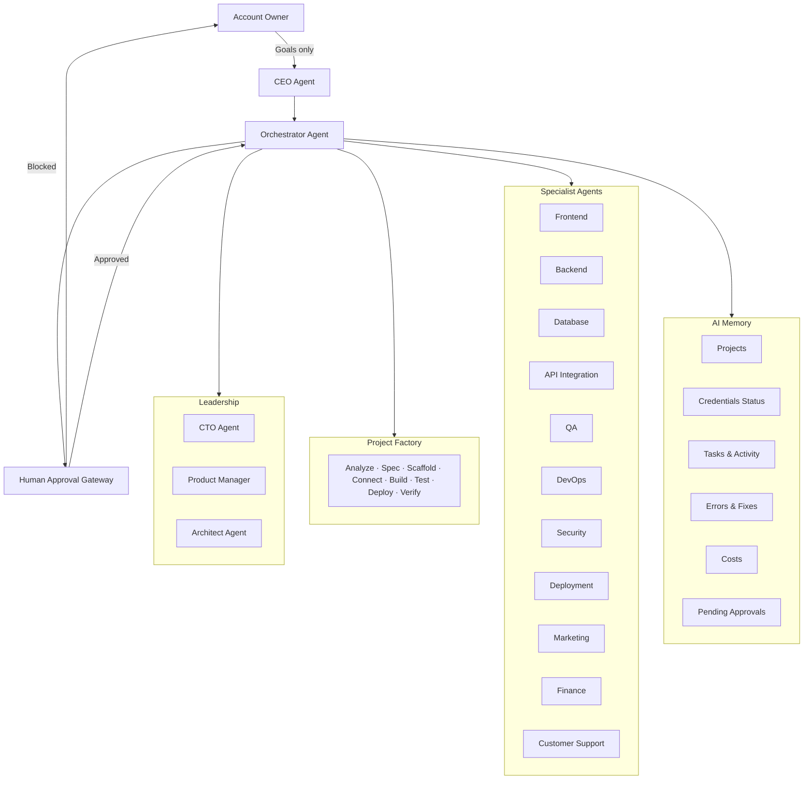

# HUSAI-OS 2.0 Architecture

## Vision

**HUSAI-OS 2.0** is an Autonomous AI Company. The user states goals; agents execute everything. Human involvement is limited to five approval types: OAuth, OTP, payment, KYC, legal.

## System Diagram



## Core Components

### CEO Agent
Receives goals → business + technical tasks → priorities → final reports.

### Orchestrator Agent
Runs all workflows, assigns specialists, retries failures, escalates only via Human Approval Gateway.

### Specialist Agents (2.0)

| Agent | Role |
|-------|------|
| CTO Agent | Technical leadership, stack approval |
| Product Manager | Requirements, acceptance criteria |
| Architect | System design, schemas, API contracts |
| Frontend | UI and client logic |
| Backend | API routes, server logic |
| Database | Migrations, RLS, performance |
| API Integration | Third-party services |
| QA | Tests and quality gates |
| DevOps | CI/CD, monitoring |
| Security | Audits, secret scanning |
| Deployment | Vercel, releases, rollbacks |
| Marketing | Launches, analytics |
| Finance | Cost tracking |
| Customer Support | Incident triage, recovery coordination |
| Setup | Platform connection, env files |

### Human Approval Gateway
Unified approval system. Allowed stops: **OAuth · OTP · payment · KYC · legal**.

### Project Factory
Full pipeline: analyze → spec → folder → GitHub → Vercel → Supabase → env → frontend → backend → schema → tests → fix → deploy → verify → URL.

### Autonomous Recovery
Detect → diagnose → fix → retry (3×) → escalate to Gateway if blocked.

Scripts: `scripts/health-check.js`, `scripts/autonomous-recovery.js`

### AI Memory
Store: `projects/ai-memory.json` — projects, platforms, credentials status, tasks, activity, errors, fixes, costs, deployments, pending approvals.

Dashboard bundle: `husai-dashboard/src/data/ai-memory.json`

## Data Flow

```
Goal → CEO → Orchestrator → [Product Manager → Architect → CTO]
  → Project Factory → Specialists → QA + Security → Deployment
  → AI Memory update → CEO final report
```

## Repository Structure

```
hus-ai-os/
├── agents/              # 20+ agent definitions
├── projects/
│   ├── registry.json    # Project registry
│   └── ai-memory.json   # AI Memory (v2)
├── scripts/
│   ├── health-check.js
│   ├── autonomous-recovery.js
│   ├── create-project.js
│   └── sync-dashboard-data.js
├── husai-dashboard/     # 2.0 control plane UI
└── docs/
```
