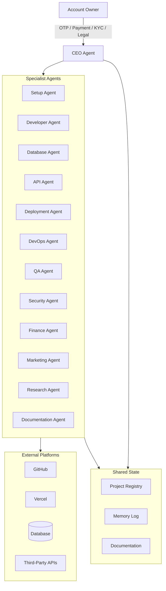

# HUSAI-OS Architecture

## Vision
HUSAI-OS is an AI Operating System that autonomously manages software projects through a modular multi-agent architecture. Human involvement is limited to OTP, payment approval, KYC, and legally required consent.

## System Diagram



## Layers

### 1. Orchestration Layer
- **CEO Agent** — single entry point for prioritization, assignment, and reporting
- Reads/writes **Project Registry** in `/docs/memory.md`
- Enforces **Operating Rules** — only four human interrupt types

### 2. Execution Layer
Thirteen specialist agents with non-overlapping primary ownership:

| Agent | Domain |
|-------|--------|
| Setup | Bootstrap, integrations |
| Developer | Application code |
| Database | Schemas, migrations |
| API | External services |
| Deployment | GitHub, Vercel, releases |
| DevOps | CI/CD, monitoring |
| QA | Testing, quality gates |
| Security | Secrets, audits |
| Finance | Cost tracking |
| Marketing | Launches, analytics |
| Research | Tech/API analysis |
| Documentation | Doc sync |

### 3. Project Layer
Each project defined in `/projects/*.md` with:
- Goals and tech stack
- Registry status (GitHub, Deploy, DB, APIs)
- Pending work queue
- Human gates anticipated

### 4. Platform Layer
Standard external services synchronized per project:
- **GitHub** — source of truth, CI, secrets
- **Vercel** — hosting, preview deploys, env vars
- **Database** — Supabase default (Postgres)
- **APIs** — per project requirements

### 5. Knowledge Layer
- `/docs/standards.md` — coding and ops conventions
- `/docs/operating-rules.md` — autonomy boundaries
- `/docs/memory.md` — living registry and decision log
- `/docs/roadmap.md` — strategic timeline

## Communication Model

Agents do not run as separate processes in v1. They are **role definitions** invoked by the Cursor agent (or future SDK agents) following `HUSAI_AGENT.md` orchestration rules.

### Task Flow
```
1. CEO reads memory.md + project specs
2. CEO assigns task to specialist (documented in memory)
3. Specialist executes within autonomy rules
4. Specialist updates memory + notifies downstream agents
5. Documentation Agent syncs artifacts
6. CEO reports aggregate status
```

## Data Flow

```
Project Spec → Setup → GitHub + Vercel + DB
                    ↓
              Developer (features)
                    ↓
         QA ← → Security (gates)
                    ↓
              Deployment (prod)
                    ↓
         Marketing + Finance (post-launch)
```

## Security Architecture
- Secrets only in GitHub Secrets / Vercel Env — never in repo
- Security Agent scans every PR
- RLS on all multi-tenant databases
- Fail-closed auth on all production routes

## Scalability Path

| Phase | Capability |
|-------|------------|
| v1 (now) | Markdown agent defs + Cursor orchestration |
| v2 | Cursor SDK agents per role |
| v3 | Scheduled automations (cron agents) |
| v4 | Multi-repo federation under CEO |

## Repository Structure

```
hus-ai-os/
├── README.md
├── HUSAI_AGENT.md
├── agents/           # 13 agent role definitions
├── projects/         # Project specs + registry links
└── docs/             # Architecture, rules, living memory
```

Project application code lives in **separate GitHub repos** linked from the registry—not in this meta-repo.
