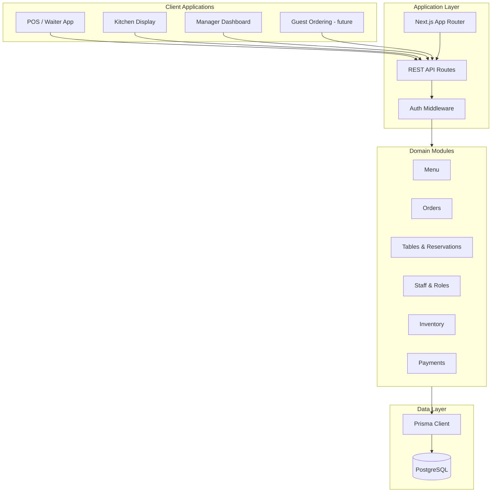
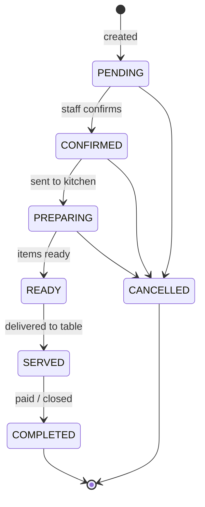

# Restaurant OS — Architecture

## Overview

Restaurant OS is a **multi-tenant, multi-location** platform that unifies front-of-house (FOH), back-of-house (BOH), and management workflows. Each **organization** (restaurant brand or group) can operate multiple **locations**. Staff, menus, inventory, and orders are scoped to locations while sharing organization-level configuration where appropriate.

## Goals

1. **Single source of truth** for menus, prices, and availability across POS, kitchen display, and online ordering.
2. **Real-time order pipeline** from table/guest → kitchen → payment with auditable state transitions.
3. **Operational clarity** for managers: reservations, table status, shift staff, and basic inventory signals.
4. **Isolation** — deploy and evolve inside `restaurant-os/` without touching the parent workspace.

## High-Level Architecture

## Module Boundaries

| Module | Responsibility | Key entities |
|--------|----------------|--------------|
| **Organization** | Tenant root, billing metadata (future) | `Organization`, `Location` |
| **Staff** | Users, roles, location assignments | `User`, `StaffProfile`, `Role` |
| **Menu** | Categories, items, variants, modifiers | `MenuCategory`, `MenuItem`, `ModifierGroup` |
| **Tables** | Floor layout, table status | `DiningArea`, `Table` |
| **Orders** | Order lifecycle, line items, status history | `Order`, `OrderItem`, `OrderStatusHistory` |
| **Reservations** | Bookings linked to tables/guests | `Reservation`, `Guest` |
| **Inventory** | Ingredients, stock levels, adjustments | `Ingredient`, `StockLevel`, `StockAdjustment` |
| **Payments** | Charges, splits, refunds | `Payment`, `PaymentMethod` |

Modules communicate through **shared database transactions** in Phase 1. Event bus or message queue (e.g. for KDS push) is a Phase 2 consideration.

## Order Lifecycle

**Order types:** `DINE_IN`, `TAKEOUT`, `DELIVERY` (delivery routing deferred to later phase).

**Order item status** mirrors kitchen granularity: `PENDING` → `PREPARING` → `READY` → `SERVED` (or `CANCELLED`).

## Authentication & Authorization (planned)

- **Staff users** authenticate via email/password or SSO (future); JWT or session cookies via Next.js.
- **Roles** (enum): `OWNER`, `MANAGER`, `WAITER`, `KITCHEN`, `CASHIER`.
- **Scope:** `organizationId` + optional `locationId` on every mutating request.
- **Guests** — no account required for dine-in; optional `Guest` record for reservations and loyalty.

## Multi-Location Rules

| Data | Scope |
|------|--------|
| Organization settings | Organization |
| Location address, hours | Location |
| Menu | Organization default; **location overrides** via `MenuItemAvailability` |
| Tables, orders, reservations | Location |
| Staff | Organization user; **assigned** to one or more locations |
| Inventory | Per location |

## Technology Choices

| Layer | Choice | Rationale |
|-------|--------|-----------|
| API | Next.js Route Handlers | Aligns with parent stack; self-contained in `restaurant-os` |
| DB | PostgreSQL | Relational integrity, Prisma maturity, concurrent writes for orders |
| ORM | Prisma | Schema-first, migrations, type-safe client |
| Validation | Zod (planned) | Runtime validation at API boundary |
| IDs | `cuid()` | URL-safe, sortable, no UUID collision concerns at scale |

## Non-Goals (Phase 1)

- Payment processor integration (Stripe, etc.) — schema only
- Real-time WebSocket KDS — polling or SSE in Phase 2
- Delivery fleet / third-party integrations
- Mobile native apps
- Modifying files outside `restaurant-os/`

## Deployment Model (future)

- **Standalone:** `restaurant-os` runs as its own Next.js app with its own `DATABASE_URL`.
- **Optional:** Vercel or container deploy; no dependency on parent `dropshipping-research` app.

## Security Considerations

- Row-level scoping by `organizationId` / `locationId` in all queries.
- Soft deletes on menu and staff records where audit trail matters (`deletedAt`).
- `OrderStatusHistory` and `StockAdjustment` are append-only for audit.
- Secrets only in environment variables; `.env` never committed.

## Next Steps (awaiting approval)

1. Implement `package.json`, TypeScript config, and Prisma client bootstrap.
2. Run initial migration against a dev database.
3. Implement core API routes: menu read, order create/update, table status.
4. Build minimal manager and kitchen UI shells.
