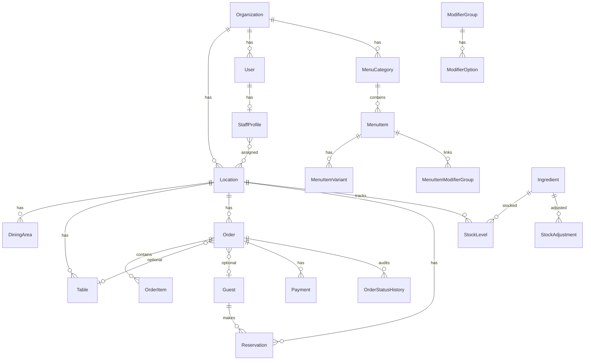

# Restaurant OS — Database Schema

This document describes the relational schema implemented in `prisma/schema.prisma`. PostgreSQL is the target database.

## Entity Relationship Overview



## Core Tables

### Organization & Location

| Table | Purpose |
|-------|---------|
| `organizations` | Tenant root (brand name, slug, timezone) |
| `locations` | Physical sites: address, phone, operating hours JSON |

Every operational record ties to a `locationId` or `organizationId` for tenant isolation.

### Staff & Access

| Table | Purpose |
|-------|---------|
| `users` | Login identity (email unique per organization) |
| `staff_profiles` | Name, role, active flag; 1:1 with `users` |
| `staff_location_assignments` | Many-to-many: staff ↔ locations |

**Roles** (`StaffRole` enum): `OWNER`, `MANAGER`, `WAITER`, `KITCHEN`, `CASHIER`.

### Menu

| Table | Purpose |
|-------|---------|
| `menu_categories` | Grouping (Appetizers, Drinks); sort order |
| `menu_items` | Dish name, description, base price, image URL |
| `menu_item_variants` | Size/portion (Small/Large) with price delta |
| `modifier_groups` | e.g. "Choose side" — min/max selections |
| `modifier_options` | Individual choices with optional price |
| `menu_item_modifier_groups` | Links items to applicable modifier groups |
| `menu_item_availability` | Per-location: available, price override |

Soft delete: `menu_categories`, `menu_items`, `modifier_groups` use `deletedAt`.

### Floor Plan

| Table | Purpose |
|-------|---------|
| `dining_areas` | Patio, Main Hall — per location |
| `tables` | Label (T1), capacity, status enum, optional area |

**Table status** (`TableStatus`): `AVAILABLE`, `OCCUPIED`, `RESERVED`, `CLEANING`.

### Orders

| Table | Purpose |
|-------|---------|
| `orders` | Header: type, status, totals, notes, table/guest links |
| `order_items` | Line: menu item, variant, quantity, unit price, status |
| `order_item_modifiers` | Selected modifier options on a line |
| `order_status_history` | Append-only status transitions with actor |

**Order type** (`OrderType`): `DINE_IN`, `TAKEOUT`, `DELIVERY`.

**Order status** (`OrderStatus`): `PENDING`, `CONFIRMED`, `PREPARING`, `READY`, `SERVED`, `COMPLETED`, `CANCELLED`.

Monetary fields use `Decimal(10, 2)` for currency precision.

### Guests & Reservations

| Table | Purpose |
|-------|---------|
| `guests` | Name, phone, email, notes — organization-scoped |
| `reservations` | Date/time, party size, status, table optional |

**Reservation status** (`ReservationStatus`): `PENDING`, `CONFIRMED`, `SEATED`, `COMPLETED`, `CANCELLED`, `NO_SHOW`.

### Inventory

| Table | Purpose |
|-------|---------|
| `ingredients` | Name, unit (g, ml, each), reorder threshold |
| `stock_levels` | Current quantity per ingredient per location |
| `stock_adjustments` | Delta, reason, staff actor — append-only audit |

### Payments

| Table | Purpose |
|-------|---------|
| `payments` | Amount, method, status, external reference |
| `payment_methods` | Organization-level enabled methods (CASH, CARD, etc.) |

**Payment status** (`PaymentStatus`): `PENDING`, `COMPLETED`, `FAILED`, `REFUNDED`.

## Indexing Strategy

| Index | Columns | Reason |
|-------|---------|--------|
| Unique | `organizations.slug` | Public tenant lookup |
| Unique | `users(organizationId, email)` | Login per org |
| Unique | `tables(locationId, label)` | No duplicate table labels |
| Index | `orders(locationId, status, createdAt)` | Kitchen / POS queues |
| Index | `orders(locationId, tableId)` | Active table orders |
| Index | `reservations(locationId, scheduledAt)` | Day view |
| Index | `menu_items(categoryId, sortOrder)` | Menu display order |

## Cascading Deletes

- **Organization delete** cascades to locations, users, menu, guests (destructive; admin-only).
- **Order delete** restricted — prefer status `CANCELLED` over hard delete; `OrderItem` cascades from order.
- **Menu item delete** soft; hard delete cascades variants and modifier links.

## Sample Queries (reference)

**Active kitchen queue for a location:**

```sql
SELECT o.id, o.order_number, oi.id AS item_id, oi.status
FROM orders o
JOIN order_items oi ON oi.order_id = o.id
WHERE o.location_id = $1
  AND o.status IN ('CONFIRMED', 'PREPARING')
  AND oi.status IN ('PENDING', 'PREPARING')
ORDER BY o.created_at ASC;
```

**Menu with location availability:**

```sql
SELECT mi.*, mia.is_available, mia.price_override
FROM menu_items mi
JOIN menu_categories mc ON mc.id = mi.category_id
LEFT JOIN menu_item_availability mia
  ON mia.menu_item_id = mi.id AND mia.location_id = $1
WHERE mc.organization_id = $2 AND mi.deleted_at IS NULL
ORDER BY mc.sort_order, mi.sort_order;
```

## Migration Notes

1. Run `prisma migrate dev --name init` after setting `DATABASE_URL`.
2. Seed script (future) will create demo organization, location, menu, and tables.
3. Use `prisma db push` only for local prototyping; prefer migrations for shared environments.

## Future Schema Extensions

- `shifts` / `time_clock` for labor
- `loyalty_points` on guests
- `recipe_items` linking menu items to ingredients (recipe costing)
- `tax_rates` and `discounts` tables
- `audit_log` generic table for non-order events
